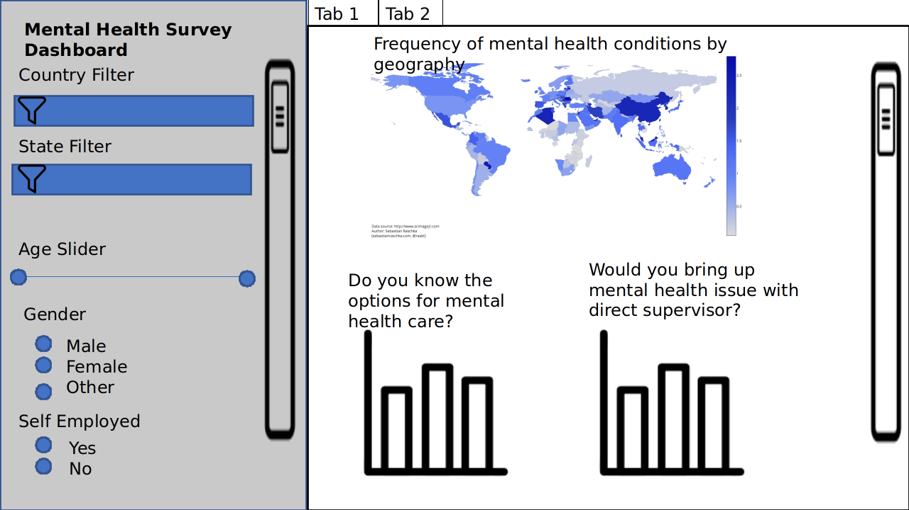

# Mental Health Awareness Dashboard
Deployment on Heroku: https://it-mental-health-dash-r.herokuapp.com/



The app is a dashboard to more efficiently consume the [mental illness survey data](https://www.kaggle.com/osmi/mental-health-in-tech-survey) and drive insights into different areas of mental illness awareness in tech companies around the world. After landing on this dashboard, users can filter generic company, employee and mental health related filters on the left hand side. For example, they can filter by region and age group. The filtering will then drive the visualizations on the tabbed right side of the app.

Each tab will then answer specific topics that our target audience might be interested in. For example, the tabs could include:
- Awareness (of mental illness)
- Healthcare Benefits (vs mental illness)
- Privacy (around mental illness)

Within each tab, we may include different visualizations that will tell a story around each topic. For example, the user may try to understand mental illness awareness by state by going to the Awareness tab and then toggling different states in the US.


## Usage

There are two suggested ways to run this analysis:

### 1. Deploy and run on Heroku

This dashboard is hosted on Heroku: https://it-mental-health-dash-r.herokuapp.com/ 
The heroku repository URL is: https://git.heroku.com/it-mental-health-dash-r.git


#### Trigger Auto-Deployment by pushing to deployment branch
Once you've cloned this github repository, you can do the following from the root of the repo:
```bash
git status
git pull upstream main  #Get latest

#Make any final changes, ex. disabling debug mode
git add .
git commit -m "change description"
git push heroku deployment

```

#### Deploy on to your own Heroku Account
Once you've cloned this github repository, you can do the following from the root of the repo:
```bash
heroku create [app_name]
heroku stack:set container.
git push heroku main

#Then run bash to run the webapp
heroku run bash

#Run the dashr app script
>$ Rscript app.R
```
#### If you make changes and want to redeply to Heroku
Note this does not include details on fork and branch handling in github.
```bash
git status
git add .
git commit -m "change description"
git push heroku main

#if the server is offline, you can start it again via bash

#Then run bash to run the webapp
heroku run bash

#Run the dashr app script
>$ Rscript app.R
```
### 2. Run without Heroku

After cloning this repository and installing the python dependencies below, run the following from the root of this repo:

```bash
Rscript app.R
```


## Dependencies

### R

Below are the R packages that must be installed 

- dash
- readr
- here
- ggthemes
- tidyverse
- remotes
- plotly

Then via remotes,
```
remotes::install_github('facultyai/dash-bootstrap-components@r-release')
install_github("plotly/dashR", upgrade=TRUE)
```
